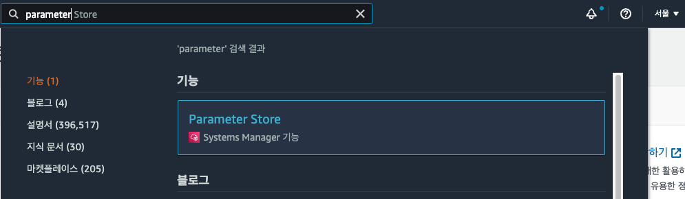
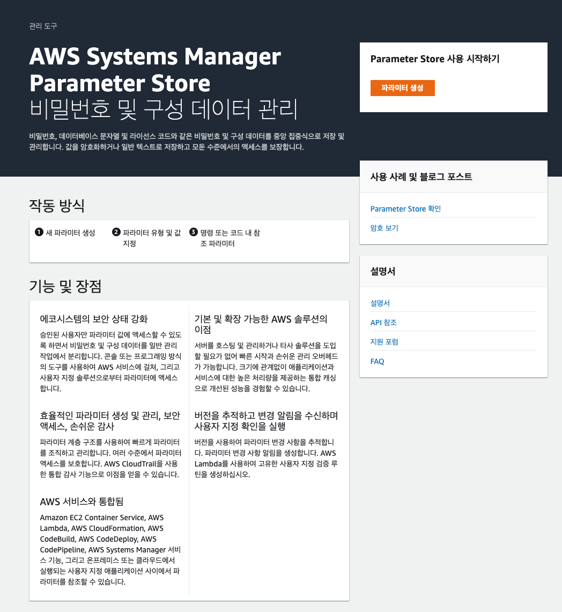
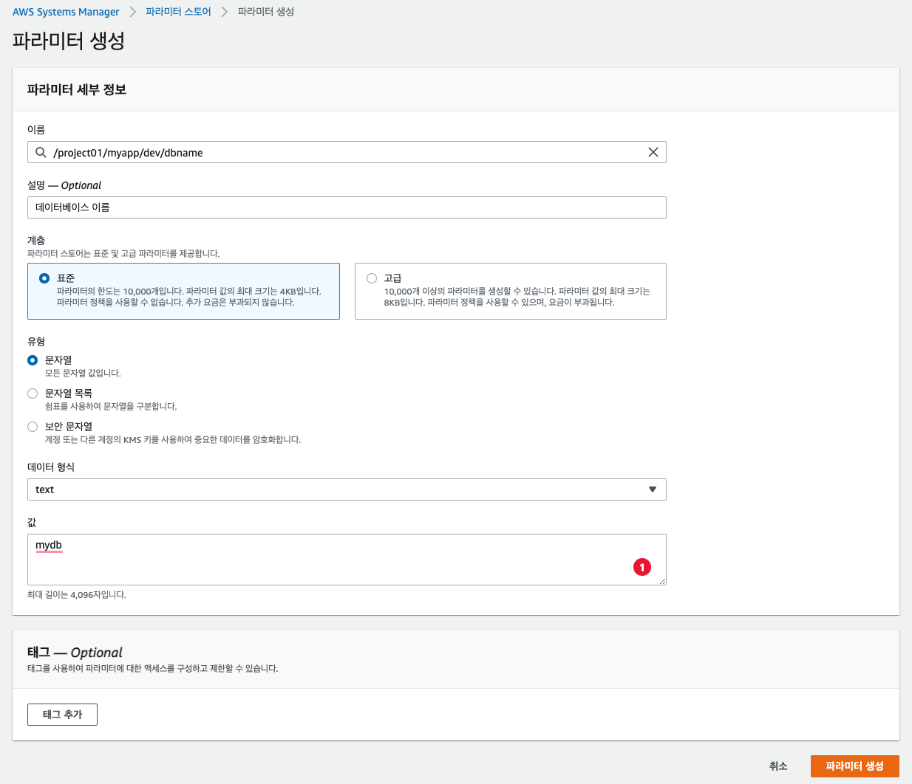
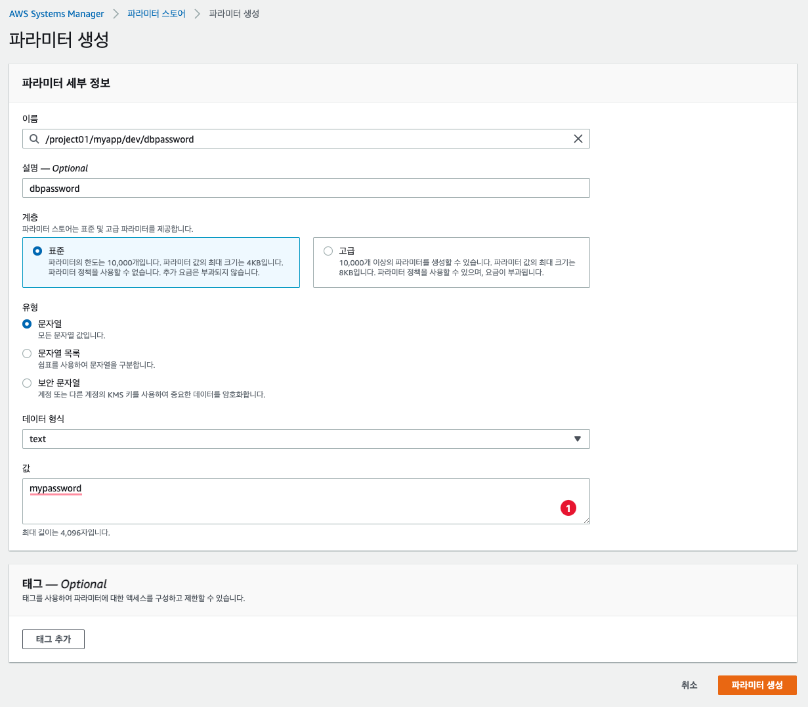
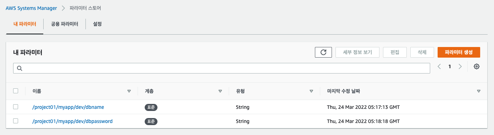

# [Hands On] Parameter Store 

## AWS Parameter Store 파라미터 생성하기 



- 파라미터 스토어를 사용하기 위해서 Parameter Store라고 검색한다. 



- 위와 같이 파라미터 스토어를 위한 설명창을 확인할 수 있다. 
- "파라미터 생성" 버튼을 클릭한다. 



- 파라미터를 내용을 다음과 같이 생성하자. 
- 이름: /project01/myapp/dev/dbname
- 설명: 필요한 이름을 지정한다.
- 계층: 표준으로 잡았다. 표준은 무료로 사용할 수 있으며, 고급은 10,000 저장마다 비용이 발생한다. 
- 유형:
  - 문자열: 단순 텍스트 문자이다. 
  - 문자열 목록: 리스트 타입의 문자열이다. 
  - 보안 문자열: 계정 또는 다른 계정의 KMS 키를 사용하는 경우 값을 암호화 한다. 
- 데이터 형식: 
  - text: 텍스트 형식이다. 
  - aws:ec2:image: ec2 이미지도 저장할 수 있다. 
- 값: 
  - 실제 저장할 값으로 mydb라고 입력했다. 

- 이후 "파라미터 생성" 버튼으로 파라미터를 생성한다. 



- 파라미터를 내용을 다음과 같이 생성하자. 
- 이름: /project01/myapp/dev/dbpassword
- 설명: 필요한 이름을 지정한다.
- 계층: 표준으로 잡았다. 표준은 무료로 사용할 수 있으며, 고급은 10,000 저장마다 비용이 발생한다. 
- 유형:
  - 문자열: 단순 텍스트 문자이다. 
  - 문자열 목록: 리스트 타입의 문자열이다. 
  - 보안 문자열: 계정 또는 다른 계정의 KMS 키를 사용하는 경우 값을 암호화 한다. 
- 데이터 형식: 
  - text: 텍스트 형식이다. 
  - aws:ec2:image: ec2 이미지도 저장할 수 있다. 
- 값: 
  - 실제 저장할 값으로 mypassword라고 입력했다. 

- 이후 "파라미터 생성" 버튼으로 파라미터를 생성한다. 



- 생성하고 나면 위와 같이 파라미터 스토어를 확인할 수 있다. 

## 운영 환경에 aws credential 지정하기. 

```py
$ aws configure

AWS Access Key ID [****************5BUF]: 
AWS Secret Access Key [****************Xckv]: 
Default region name [ap-northeast-2]: 
Default output format [json]: 
```

- 위와 같이 Credential을 등록한다. 

## Python 프로그래밍 하기. 

- python에서는 boto3 라는 라이브러리를 이용한다. 
- 다음과 같이 라이브러리를 설치하자. 

```py
pip install boto3
```

### 조회 Source 작성하기. 

- test_parameter_store.py 파일을 생성한다. 
  
```py
import boto3

DB_NAME = '/project01/myapp/dev/dbname'
DB_PASSWORD = '/project01/myapp/dev/dbpassword'

ssm = boto3.client('ssm')

db_name = ssm.get_parameter(Name=DB_NAME, WithDecryption=False)
db_password = ssm.get_parameter(Name=DB_PASSWORD, WithDecryption=False)

# print(db_name['Parameter']['Value'])
# print(db_password['Parameter']['Value'])

print( f'DB_NAME: {db_name.get("Parameter").get("Value")}' )
print( f'DB_PASSWORD: {db_password.get("Parameter").get("Value")}' )
```

- 실행하면 다음과 같다. 
  
```
$ python test_parameter_store.py

DB_NAME: mydb
DB_PASSWORD: mypassword
```

