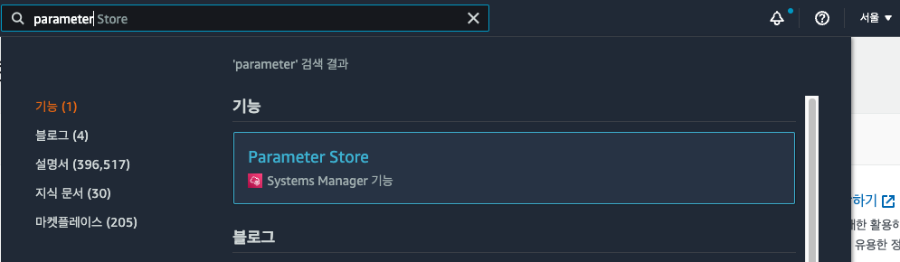
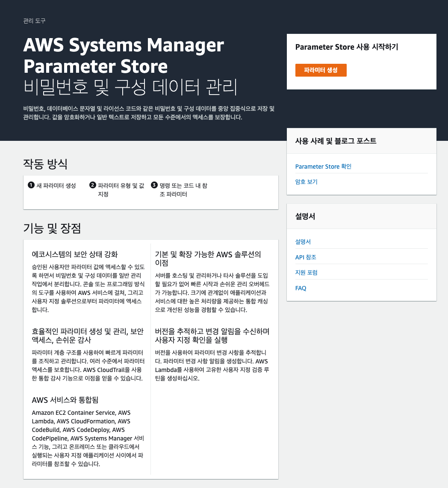
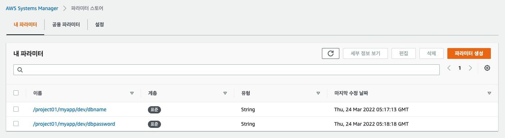

# [Hands On] Parameter Store with SpringBoot

## AWS Parameter Store 파라미터 생성하기 



- 파라미터 스토어를 사용하기 위해서 Parameter Store라고 검색한다. 



- 위와 같이 파라미터 스토어를 위한 설명창을 확인할 수 있다. 
- "파라미터 생성" 버튼을 클릭한다. 


- 파라미터를 내용을 다음과 같이 생성하자. 
- 이름: /project01/myapp_dev/dbname
- 설명: 필요한 이름을 지정한다.
- 계층: 표준으로 잡았다. 표준은 무료로 사용할 수 있으며, 고급은 10,000 저장마다 비용이 발생한다. 
- 유형: (문자열)
  - 문자열: 단순 텍스트 문자이다. 
  - 문자열 목록: 리스트 타입의 문자열이다. 
  - 보안 문자열: 계정 또는 다른 계정의 KMS 키를 사용하는 경우 값을 암호화 한다. 
- 데이터 형식: 
  - text: 텍스트 형식이다. 
  - aws:ec2:image: ec2 이미지도 저장할 수 있다. 
- 값: 
  - 실제 저장할 값으로 mydb라고 입력했다. 

- 이후 "파라미터 생성" 버튼으로 파라미터를 생성한다. 


- 파라미터를 내용을 다음과 같이 생성하자. 
- 이름: /project01/myapp_dev/dbpassword
- 설명: 필요한 이름을 지정한다.
- 계층: 표준으로 잡았다. 표준은 무료로 사용할 수 있으며, 고급은 10,000 저장마다 비용이 발생한다. 
- 유형: (문자열)
  - 문자열: 단순 텍스트 문자이다. 
  - 문자열 목록: 리스트 타입의 문자열이다. 
  - 보안 문자열: 계정 또는 다른 계정의 KMS 키를 사용하는 경우 값을 암호화 한다. 
- 데이터 형식: 
  - text: 텍스트 형식이다. 
  - aws:ec2:image: ec2 이미지도 저장할 수 있다. 
- 값: 
  - 실제 저장할 값으로 mypassword라고 입력했다. 

- 이후 "파라미터 생성" 버튼으로 파라미터를 생성한다. 



- 생성하고 나면 위와 같이 파라미터 스토어를 확인할 수 있다. 


## KMS를 이용하여 암호화된 파라미터 생성 


- 파라미터를 이번에는 다음과 같이 설정한다. 
- 이름: /project01/myapp_dev/api.password
- 설명: api 비밀번호
- 계층: 표준으로 잡았다. 표준은 무료로 사용할 수 있으며, 고급은 10,000 저장마다 비용이 발생한다. 
- 유형: (보안 문자열)
  - 문자열: 단순 텍스트 문자이다. 
  - 문자열 목록: 리스트 타입의 문자열이다. 
  - 보안 문자열: 계정 또는 다른 계정의 KMS 키를 사용하는 경우 값을 암호화 한다. 
- KMS 키 소스: 
  - Key Management System 에서 키 소스를 "내 현재 계정" 으로 선택한다. 나의 어카운트로 KMS를 접근할 수 있게 된다. 
  - 다른 계정: KMS 관리를 다른 계정으로 수행하는경우 사용할 수 있다. 
- 값: apipassword!@#$ 으로 설정했다. 

- "파라미터 생성" 버튼을 클릭하고 저장한다. 


- 실제 생성된 파라미터를 확인하면 유형에 "SecureString" 으로 되어 있다. 
- 즉 암호화 된 유형으로 생성되었음을 알 수 있다. 

## 운영 환경에 aws credential 지정하기. 

```py
$ aws configure

AWS Access Key ID [****************5BUF]: 
AWS Secret Access Key [****************Xckv]: 
Default region name [ap-northeast-2]: 
Default output format [json]: 
```

- 위와 같이 Credential을 등록한다. 

## Spring Boot 프로그래밍하기. 

- SpringBoot 에서 이용하기 위해서 SpringCloudAWS를 이용한다. 

## pom.xml 파일 설정하기. 

- 스프링부트의 경우 의존성 매치가 매우 중요하므로, 여기서는 버전을 주의깊게 확인해야한다. 

- 기본 스프링부트 버젼 

```xml
	<parent>
		<groupId>org.springframework.boot</groupId>
		<artifactId>spring-boot-starter-parent</artifactId>
		<version>2.6.4</version>
		<relativePath/> <!-- lookup parent from repository -->
	</parent>
```

- 스프링클라우드 aws 의존성 

```xml
	<dependencyManagement>
		<dependencies>
			<dependency>
				<groupId>io.awspring.cloud</groupId>
				<artifactId>spring-cloud-aws-dependencies</artifactId>
				<version>2.3.3</version>
				<type>pom</type>
				<scope>import</scope>
			</dependency>
		</dependencies>
	</dependencyManagement>
```

- ParameterStore 의존성 

```xml
		<dependency>
			<groupId>io.awspring.cloud</groupId>
			<artifactId>spring-cloud-starter-aws-parameter-store-config</artifactId>
		</dependency>
```

## properties 추가하기. 

### application.yml 의 경우 

```yaml
spring:
  config:
    activate:
      on-profile: dev
    import: 'aws-parameterstore:'

aws:
  paramstore:
    enabled: true
    prefix: /project01
    profile-separator: _
    name: myapp
```

- spring.config.activate.on-profile: dev는 dev환경의 파라미터 스토어를 이용한다는 의미이다. 
- spring.config.import 는 config 설정을 어디서 가져올지 지정한다. 여기서는 (') 로 감싼 'aws-parameterstore:' 값으로 aws의 parameterstore를 이용하겠다는 의미이다. 
- aws.paramstore.enabled: true값으로 활성화 한다. 
- aws.paramstore.prefix: 파라미터 스토어 값의 prefix 이다. 여기서는 '/project01' 로 설정했다. 
- aws.paramstore.name: 파라미터스토어의 prefix다음에 올 이름이다. 
- aws.paramstore.profile-separator: 이 설정은 액티브 프로파일을 기준으로 구분자를 나타낸다. 여기서는 '_'이용했다. 

***중요*** 

- 우리가 지정한 ParameterStore는 '/project01/myapp_dev/dbname' 으로 지정했다. 
- 즉 '/<prefix>/<name>_<profile>/key값' 의 형태로 파라미터 스토어의 이름을 지정해주어야 spring-boot에서 읽을 수 있게 된다. 

### application.properties 의 경우 

```
spring.config.activate.on-profile=dev
spring.config.import=aws-parameterstore:

aws.paramstore.enabled=true
aws.paramstore.prefix=/project01
aws.paramstore.profile-separator=_
aws.paramstore.name=myapp
```

- 차이는 'spring.config.import=aws-parameterstore:' 으로 yaml과 다르게 'aws-parameterstore:' 의 값을 (') 로 감싸지 않았다는 것이다. 

## 어플리케이션 테스트하기 

- ParameterStoreApplication.java 파일을 생성하고 다음과 같이 입력한다. 

```java
package com.schooldevops.ssm.parameterstore;

import org.springframework.beans.factory.annotation.Value;
import org.springframework.boot.CommandLineRunner;
import org.springframework.boot.SpringApplication;
import org.springframework.boot.autoconfigure.SpringBootApplication;
import org.springframework.stereotype.Component;

@Component
@SpringBootApplication
public class ParameterStoreApplication implements CommandLineRunner {

	public static void main(String[] args) {
		SpringApplication.run(ParameterStoreApplication.class, args);
	}

	@Value("${dbname}")
	private String dbname;

	@Value("${test.value}")
	private String testValue;

	@Value("${api.password}")
	private String api_password;

	@Override
	public void run(String... args) throws Exception {
		System.out.println("DBName: " + dbname + " : " + testValue + " apiPassword: " + api_password);
	}
}


```

- 위와 같이 이제 '@Value("${dbname}")' 으로 파라미터 스토어에서 값을 가져올 수 있게 된다. 
- 즉, '/project01/myapp_dev/dbname' 에 해당하는 값을 가져온다. 
- 만약 실행시에 active-profile 옵션을 주지 않으면 '/project01/myapp/dbname' 에서 값을 가져올 것이다. 

- 실행결과 :

```
mvn spring-boot:run -Dspring-boot.run.profiles=dev
```

- 프로파일을 위와 같이 설정했다. 

```
DBName: dbname_test : hello apiPassword: apipassword!@#$

```

- 위와 같이 우리가 원하는 값이 나왔다. 