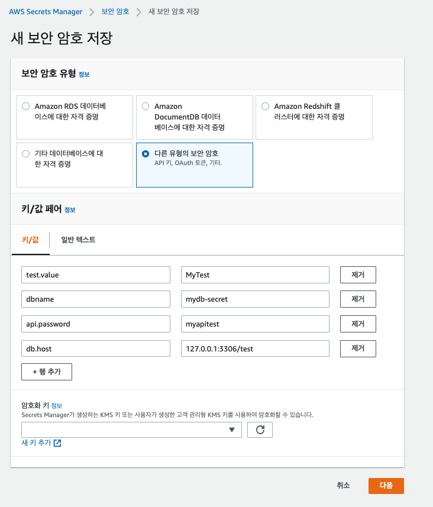
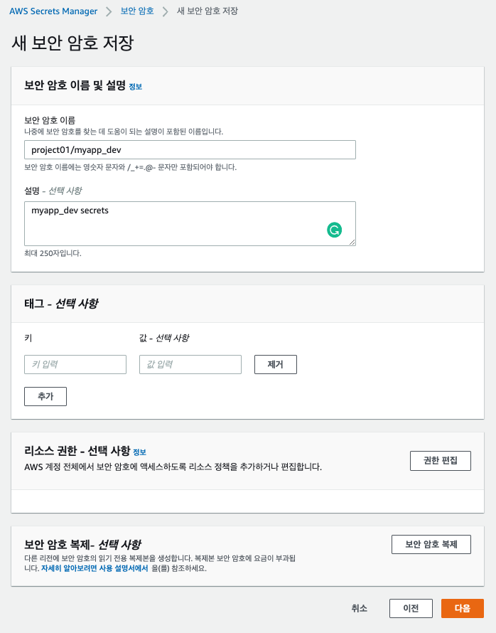
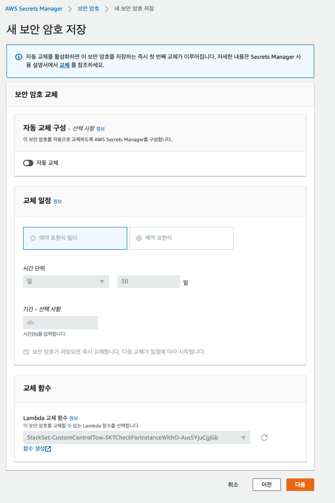
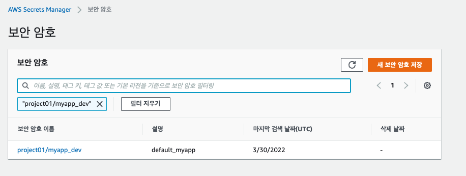
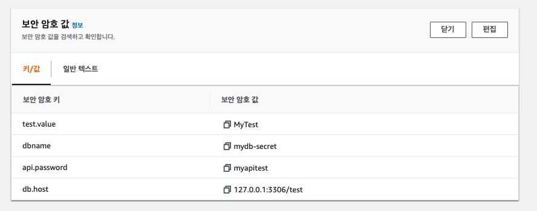

# SecretsManager 를 Spring에서 이용하기. 

## 시크릿 생성하기. 

- SecretManager를 검색하고 메뉴로 들어간다. 
  


- 새 보안 암호 저장에서 다음과 같이 설정한다. 
  - 보안 암호 유형: 다른 유형의 보안 암호
  - 키/값 페어:
    - test.value: MyTest
    - dbname: mydb-secret
    - api.password: myapitest
    - db.host: 127.0.0.1:3306/test
- 이후 '다음' 을 클릭한다. 
  


- 보안 암호 이름을 'project01/myapp_dev' 로 지정한다. 
- 형식은 '<projectName>/<applicationName>_<env>' 형식으로 추가한다.
- 이후 '다음' 을 클릭한다. 



- 내용을 확인하고 '다음' 을 클릭한다. 


## 생성된 보안 암호 검색하기 



- 생성된 보안 암호를 입력하고, 내용을 확인한다. 



- '보안 암호값 검색' 을 클릭하여 위와 같이 내용을 확인한다. 

## Spring Boot 프로그래밍하기. 

- SpringBoot 에서 이용하기 위해서 SpringCloudAWS를 이용한다. 

## pom.xml 파일 설정하기. 

- 스프링부트의 경우 의존성 매치가 매우 중요하므로, 여기서는 버전을 주의깊게 확인해야한다. 

- 기본 스프링부트 버젼 

```xml
	<parent>
		<groupId>org.springframework.boot</groupId>
		<artifactId>spring-boot-starter-parent</artifactId>
		<version>2.6.4</version>
		<relativePath/> <!-- lookup parent from repository -->
	</parent>
```

- 스프링클라우드 aws 의존성 

```xml
	<dependencyManagement>
		<dependencies>
			<dependency>
				<groupId>io.awspring.cloud</groupId>
				<artifactId>spring-cloud-aws-dependencies</artifactId>
				<version>2.3.3</version>
				<type>pom</type>
				<scope>import</scope>
			</dependency>
		</dependencies>
	</dependencyManagement>
```

- SecretsManager 의존성 

```xml
		<dependency>
			<groupId>io.awspring.cloud</groupId>
			<artifactId>spring-cloud-starter-aws-secrets-manager-config</artifactId>
		</dependency>
```

## properties 추가하기. 

### application.yml 의 경우 

```yaml
spring:
  config:
    activate:
      on-profile: default
dbname: dbname-default
test:
  value: Hello-default
db:
  db-host: localhost:3306
---
spring:
  config:
    activate:
      on-profile: dev
    import: 'optional:aws-secretsmanager:project01/myapp_dev'

aws:
  secretsmanager:
    enabled: true

test:
  value: Hello-dev
db:
  db-host: ${db.host}
```

- 상단 환경은 기본 환경이다.. 'on-profile: default' 으로 지정한다.
- 하단의 환경은 dev환경 이다. 'on-profile: dev' 으로 지정한다. 
- import: 'optional:aws-secretsmanager:project01/myapp_dev' 으로 조금전에 생성한 시크릿을 참조하도록 한다. 
- aws.secretsmanager.enabled: true로 지정하여 Secrets Manager를 활성화 한다. 
- db.db-host: ${db.host} 을 지정하면, 프로퍼티에서 시클릿을 플레이스 홀더로 조회할 수 있도록 하였다. 

## 샘플 코드 작성하기. 

```java
package com.schooldevops.ssm.secretsmanager;

import org.springframework.beans.factory.annotation.Value;
import org.springframework.boot.CommandLineRunner;
import org.springframework.boot.SpringApplication;
import org.springframework.boot.autoconfigure.SpringBootApplication;
import org.springframework.stereotype.Component;

@Component
@SpringBootApplication
public class SecretsManagerApplication implements CommandLineRunner {

	public static void main(String[] args) {
		SpringApplication.run(SecretsManagerApplication.class, args);
	}

	@Value("${dbname}")
	private String dbname;

	@Value("${test.value}")
	private String testValue;

	@Value("${api.password}")
	private String api_password;

	@Value("${db.db-host}")
	private String db_host;

	@Override
	public void run(String... args) throws Exception {
		System.out.println("DBName: " + dbname + " : " + testValue + " apiPassword: " + api_password + " : db_host: " + db_host);
	}
}

```

- 위와 깉이 CommandLineRunner를 구현하여, 서버가 올라올때 시크릿 정보를 노출하도록 한다. 
- dbname, test.value, api.password, db.db-host 로 프로퍼티 값을 시크릿에서 조회할 수 있도록 작업하였다. 

## 실행하기. 

```py
mvn spring-boot:run -Dspring-boot.run.profiles=dev
```

- 위 내용을 통해서 스프링 부트를 프로퍼티를 추가하여 실행하였다. 

```py
DBName: mydb-secret : MyTest apiPassword: myapitest : db_host: 127.0.0.1:3306/test 
```

- 위와 같이 생성되었음을 확인할 수 있다. 

## WrapUp

- ParameterStore와 약간 다르게     import: 'optional:aws-secretsmanager:project01/myapp_dev' 을 이용하여 시크릿 매니저를 직접 지정하였다. 
- 물론 ParameterStore와 유사하게 다음과 같은 형식으로 추가할 수도 있다. 

```py
aws:
  aws:
  paramstore:
    enabled: true
    prefix: project01
    profile-separator: _
    name: myapp:
```

- 직접 SecretsManager에 접속하여 파라미터를 조회하는 것은 안전하게 민감한 내역을 어플리케이션으로 저장할 수 있는 좋은 방법을 제공한다. 