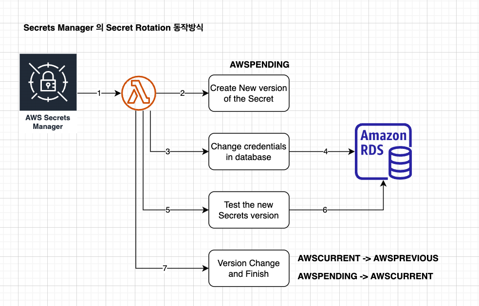

# Secret Rotation 동작 

- AWS SecretsManager는 암호를 정기적으로 갱신하고, 이를 자동으로 반영해 준다. 

## Secret Rotation 동작방식 

- Step 1: Create a new version of secret (createSecret)
- Step 2: Change the credentials in the database or service (setSecret)
- Step 3: Test the new secret version (testSecret)
- Step 4: Finish the rotation (finishSecret)

from: https://docs.aws.amazon.com/secretsmanager/latest/userguide/rotate-secrets_how.html

## 결론 

- 위 과정과 SpringCloud SecretManager 라이브러리 혹은 python boto3 라이브러리를 이용하여 DB에 접근하고자 하는 username/password 정보를 필요할때 조회하여 데이터베이스에 변경된 정보로 접근이 가능하다. 

